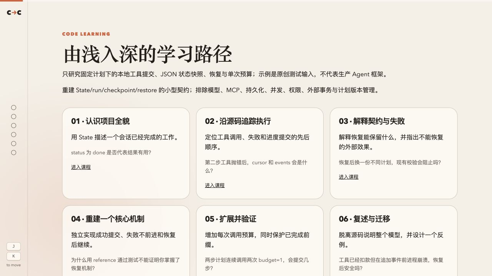

# Codebase to Mastery · 源码掌握工坊

**从读懂真实源码，走向能够解释、重建、验证并迁移其中的机制。**

[English](README.md) · [Skill 入口](SKILL.md) · [验证范围](docs/validation.md) · [MIT 许可证](LICENSE)

这是一个支持 **Codex、Claude Code 和通用 Agent Skills 客户端**的 Skill。输入本地代码库或 GitHub 项目，输出源码可追溯的学习包、离线交互课程和有边界的实践练习。



## 设计差异

学习围绕六层能力推进：

| 层次 | 要形成的能力 | 材料与验证 |
| --- | --- | --- |
| 认识全貌 | 说明产品、组件和边界 | 架构概览、具体用户旅程 |
| 追踪源码 | 沿调用和状态变化阅读 | 阅读顺序、精确摘录、前置概念 |
| 解释设计 | 说明契约、不变量和失败路径 | 反例、替代方案、评价标准 |
| 局部重建 | 独立实现一段核心行为 | starter、独立 reference、共用测试 |
| 扩展验证 | 改一个行为并保护旧行为 | 扩展案例和回归检查 |
| 复述迁移 | 从记忆重建模型并处理新情境 | 主动回忆、迁移题、真实学习记录 |

大项目先读通，再选择一个子系统重建。源码变更会生成模块、概念、前置依赖和练习的复核清单；历史回答不会被覆盖。源码摘录同时检查编辑材料和最终 HTML。

**教材可用、参考实现通过、学习者掌握，是三个不同结果。** 掌握记录需要真实回答和评价；重建或扩展还需要当前有效的 learner 运行记录。

## 安装

在目标项目目录，一次安装到 Codex 和 Claude Code：

```bash
npx skills add StormTian/codebase-to-mastery \
  --skill codebase-to-mastery --agent codex claude-code
```

这是 [Skills CLI](https://github.com/vercel-labs/skills) 的安装方式。个人全局安装可加 `--global`，其他客户端使用对应 `--agent`。Node.js 只用于这个安装方式；Skill 的辅助脚本使用 Python 标准库。

手工安装到 Codex 当前官方文档中的个人目录：

```bash
mkdir -p ~/.agents/skills
git clone https://github.com/StormTian/codebase-to-mastery.git \
  ~/.agents/skills/codebase-to-mastery
```

手工安装到 Claude Code：

```bash
mkdir -p ~/.claude/skills
git clone https://github.com/StormTian/codebase-to-mastery.git \
  ~/.claude/skills/codebase-to-mastery
```

项目级安装分别放在 `.agents/skills/codebase-to-mastery` 或 `.claude/skills/codebase-to-mastery`。部分 Codex 安装和 Skills CLI 的全局目标仍使用 `~/.codex/skills`，按实际客户端的发现目录选择，每个客户端保留一份入口。已有 clone 可先检查本地修改，再执行 `git pull --ff-only`。

其他通用客户端按其文档放入完整 Skill 文件夹，保留脚本、参考和资产的相对路径。`agents/openai.yaml` 只是 Codex 的可选界面信息，核心流程不依赖它。安装位置依据 [OpenAI 文档](https://learn.chatgpt.com/docs/build-skills)、[Claude Code 文档](https://code.claude.com/docs/en/skills) 和 [Agent Skills 规范](https://agentskills.io/specification)。

## 使用

Codex：

```text
用 $codebase-to-mastery 带我由浅入深学习这个项目。
先解释产品和架构，再沿一次请求读源码，
最后选择一个小型子系统做重建、扩展和迁移练习。
```

Claude Code：

```text
/codebase-to-mastery 带我由浅入深学习这个项目，包含源码追踪、
主动回忆、局部重建和有测试的扩展练习。
```

也可以只选一个模式：交互概览、子系统深学、逐题导师、代码变更课，或更新已有学习包。提供你的基础、语言、目标和想研究的子系统即可；产物请求默认直接制作完整材料。

## 环境和产物

需要能够读写文件、执行命令的 Agent，以及 **Python 3.10+**；Git 用于获取源码和记录版本。浏览器帮助验证交互课程。拉取远程源码需要网络，生成的 HTML 可离线阅读。辅助脚本无需模型 API Key、MCP 服务或付费接口。

学习包包含：可编辑 manifest 和 HTML 模块、学习路径、架构与执行说明、精确 source map、主动回忆题、starter/reference/tests、实际 lab-runs，以及按需产生的学习记录和增量更新报告。Markdown 是生成视图，修改正文应回到 manifest 或模块文件。

浏览器保存的是尚未评价的回忆笔记；它不会直接修改掌握状态。源码或评价标准变化后，历史状态保留，并提示重新复核。

## 运行教学样例

在本仓库根目录执行，输出目录必须全新：

```bash
python3 tests/create_demo.py /tmp/codebase-to-mastery-demo
python3 scripts/check_milestone.py /tmp/codebase-to-mastery-demo \
  --milestone core --variant starter
python3 scripts/check_milestone.py /tmp/codebase-to-mastery-demo \
  --milestone core --variant reference
python3 -m unittest discover -s tests -v
```

打开生成的 `index.html`。core 的 starter 应为 `EXPECTED_INCOMPLETE`，reference 应为 `PASS`。样例是原创小型执行器，不代表真实 Agent 框架或生产恢复行为。

详见 [验证范围](docs/validation.md)、[学习包编写](references/learning-kit.md)、[重建练习](references/rebuild-labs.md)、[导师和状态](references/tutoring.md)。跨客户端安装兼容，不等于已经验证所有客户端的端到端教学效果。

## 来源与边界

仓库采用单 Skill 根目录结构：`SKILL.md`、`scripts/`、`references/`、`assets/`、`tests/`。参考了 [anthropics/skills](https://github.com/anthropics/skills) 的独立 Skill 文件夹方式和 [vercel-labs/skills](https://github.com/vercel-labs/skills) 的安装体验，文档与工具独立实现。[来源说明](references/provenance.md) 保留冻结版本。

事实、文档观点、推断和实际运行证据分别标注。练习命令执行前需审阅；runner 不使用 shell 字符串，但不是操作系统沙箱。真实学习回答、凭据和本机运行材料不应进入共享仓库。

[MIT 许可证](LICENSE) 适用于本仓库的原创内容；被讲解项目的源码摘录仍遵循各自许可证。
